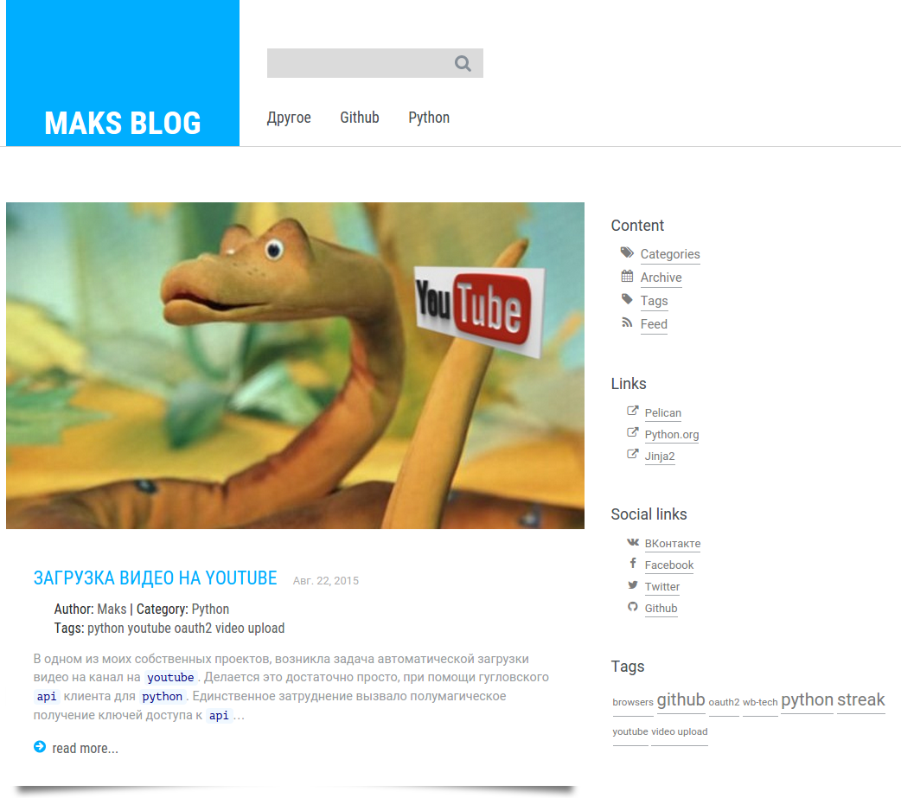
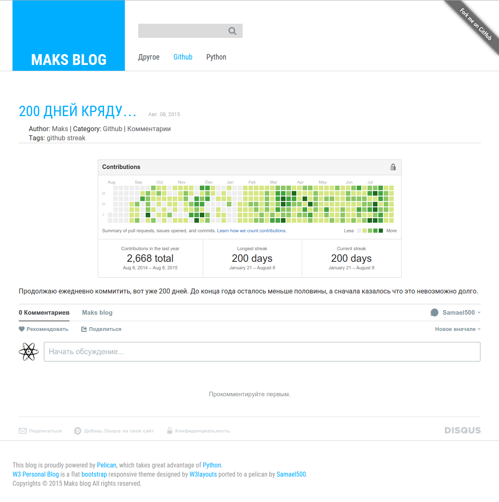
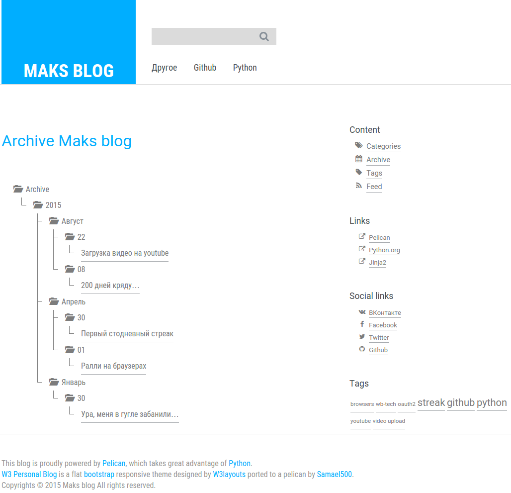
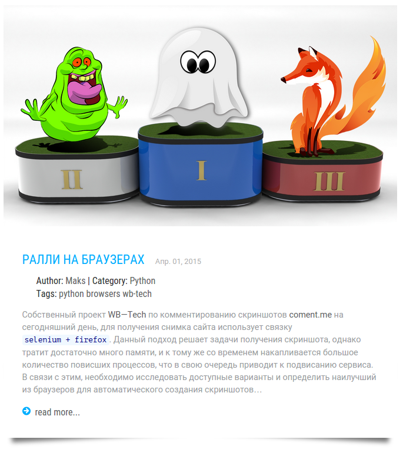

Personal Blog a Blogging Category Flat Bootstrap Responsive Web Template
---

Pelican adaptation of W3 Personal Blog template. [Live demo](http://samael500.github.io/).


<hr />

<hr />



[Personal Blog](https://w3layouts.com/personal-blog-a-blogging-category-flat-bootstrap-responsive-web-template/)
is a clean, flat and professional Blogging category template for
bloggers and blogging website. It can be customized easily to suit your wishes.
It comes with a free Flat Responsive web design template.
You can use this template for any type of websites.

Personal Blog web template is built in a Fancy style however it can be used
as per the user requirements. Personal Blog designed with a clean flat grid
system. It is compatible in all web browsers,Smartphones and Tablets.It is
designed using HTML5 and CSS3.

###Template Information
- **Template Name:** Personal Blog a Blogging Category Flat Bootstrap Responsive Web Template
- **Licence:** Life Time Free Licence under Creative Commons Attribution 3.0
- Unported. Unlimited Use, Source files & PSD included, you can help & support us
- (W3Layouts, a Non-Profit) by donations or you should keep link to our website.
- **Date Created:** Feb 21, 2015
- **Compatible Browsers:** Google Chrome, Firefox, Safari, IE, Opera etc
- **High Resolution:** Yes
- **Layout:** Fluid Responsive Layout
- **Source Files included:**  HTML files (.html), Style Sheets (.css), Images (.jpg/png/gif),
- **Tags:** Free Responsive Template, free responsive templates download, free
responsive mobile templates, free html5 css3 templates, free fluid responsive
themes, single flat Responsive web template, cross-browser compatible web
template, best responsive template.
- **Download PSD:** [Here](http://www.alltemplateneeds.com/psd-templates/free-psd-website-template/free-psd-110.html)

This entry was posted in [Blogging Template](https://w3layouts.com/blogging-template/).

###Article image
On the main page of the article is displayed with a preview image. To specify the image to add to the meta tag information `Image`.



For example:
```Markdown
Title: Ралли на браузерах
Date: 2015-04-01 10:20
Modified: 2015-04-05 19:30
Category: Python
Tags: python, browsers, wb-tech
Image: /media/browsers/pedestal.png
Summary:
    Собственный проект [WB--Tech](http://wbtech.pro/) по комментированию
    скриншотов [coment.me](http://coment.me/) на сегодняшний день, для получения
    снимка сайта использует связку `selenium + firefox`. Данный подход решает
    задачи получения скриншота, однако тратит достаточно много памяти, и к тому же
    со временем накапливается большое количество повисших процессов, что в свою
    очередь приводит к подвисанию сервиса. В связи с этим, необходимо исследовать
    доступные варианты и определить наилучший из браузеров для автоматического
    создания скриншотов...
#

```
###Simple translation
To change the short text in the design theme, you should define constants and names.

| const name | default value |
|------------|---------------|
| ARCHIVES_TEXT | Archives |
| ARTICLESCATEGORY_TEXT | Articles in category |
| ARTICLESTAG_TEXT | Articles with tag |
| AUTHOR_TEXT | Author |
| AUTHORS_TEXT | Authors |
| CATEGORIES_TEXT | Categories |
| CATEGORY_TEXT | Category |
| TAGS_TEXT | Tags |
| COMMENTS_TEXT | Comments |
| CONTENT_TEXT | Content |
| FIRST_TEXT | first |
| LAST_TEXT | last |
| READMORE_TEXT | read more... |
| FEED_TEXT | Feed |
| GETPDF_TEXT | Get the pdf |

###Pelican conf
It is my pelicanconf.py file:
```python
#!/usr/bin/env python
# -*- coding: utf-8 -*- #
from __future__ import unicode_literals

AUTHOR = u'Maks'
SITENAME = u'Maks blog'
# SITESUBTITLE = u'Samael500'
SITEURL = 'https://samael500.github.io'
KEYWORDS = u'Samael500 personal blog'

PATH = 'content'

# languages settings
TIMEZONE = 'Europe/Moscow'
DEFAULT_LANG = u'ru'

ARCHIVES_TEXT = u'Архив'
ARTICLESCATEGORY_TEXT = u'Статьи в категории'
ARTICLESTAG_TEXT = u'Статьи с тегом'
AUTHOR_TEXT = u'Автор'
AUTHORS_TEXT = u'Авторы'
CATEGORIES_TEXT = u'Категории'
CATEGORY_TEXT = u'Категория'
TAGS_TEXT = u'Теги'
COMMENTS_TEXT = u'Комментарии'
CONTENT_TEXT = u'Содержимое'
FIRST_TEXT = u'первая'
LAST_TEXT = u'последняя'
READMORE_TEXT = u'далее...'

# Feed generation is usually not desired when developing
FEED_DOMAIN = SITEURL

# Blogroll
LINKS = (
    ('Pelican', 'http://getpelican.com/'),
    ('Python.org', 'http://python.org/'),
    ('Jinja2', 'http://jinja.pocoo.org/'),
    # ('You can modify those links in your config file', '#'),
)

# Social widget
SOCIAL = (
    ('<i class="fa-li fa fa-vk"></i> ВКонтакте', 'https://vk.com/id44829586'),
    ('<i class="fa-li fa fa-facebook"></i> Facebook', 'https://www.facebook.com/100009559792869'),
    ('<i class="fa-li fa fa-twitter"></i> Twitter', 'https://twitter.com/samael500'),
    ('<i class="fa-li fa fa-github"></i> Github', 'https://github.com/samael500'),
)

# TWITTER_USERNAME = 'samael500'
GITHUB_URL = 'https://github.com/Samael500'
GOOGLE_CUSTOM_SEARCH = '006263355362628034990:cuxoisonrno'

THEME = '../w3-personal-blog'

DISPLAY_PAGES_ON_MENU = True
DEFAULT_PAGINATION = 10

# url and path settings
RELATIVE_URLS = True
CACHE_CONTENT = False
STATIC_PATHS = ['icons', 'media', 'extra', 'emojify', 'stuff', ]
# article
ARTICLE_URL = u'articles/{category}/{slug}/'
ARTICLE_SAVE_AS = u'articles/{category}/{slug}/index.html'
# page
PAGE_URL = u'{slug}/'
PAGE_SAVE_AS = u'{slug}/index.html'
# author
AUTHOR_URL = u'author/{slug}/'
AUTHOR_SAVE_AS = u'author/{slug}/index.html'
# authors
AUTHORS_URL = u'authors/'
AUTHORS_SAVE_AS = u'authors/index.html'
# category
CATEGORY_URL = u'category/{slug}.html'
CATEGORY_SAVE_AS = u'category/{slug}.html'
# tag
TAG_URL = u'tag/{slug}/'
TAG_SAVE_AS = u'tag/{slug}/index.html'

```
